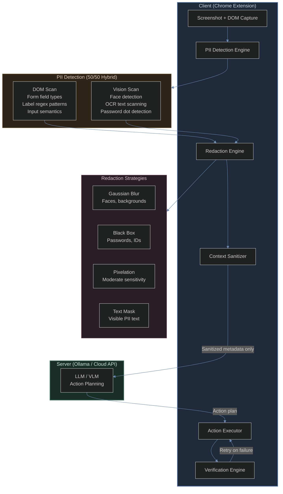
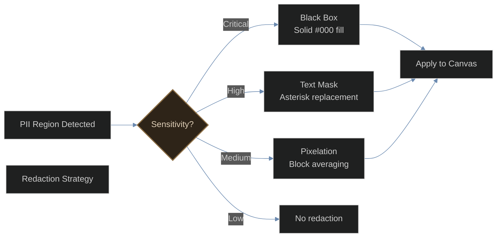
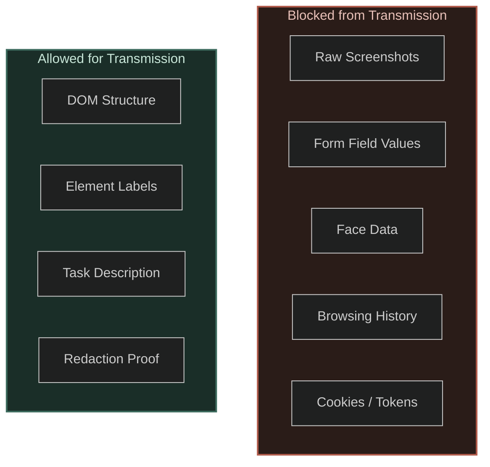

# VLESS

**Privacy-preserving browser automation through on-device visual perception.**

VLESS is a Chrome extension that uses local machine learning models to understand web pages, detect and redact personally identifiable information (PII), and automate browser tasks -- all without sending sensitive data to any external server.

Built for [Smart India Hackathon 2026](https://sih.gov.in/sih2026PS) Problem Statement 26171: *On-device Visual Perception for Lightweight Browser Agents*.

---

## Table of Contents

- [Overview](#overview)
- [Architecture](#architecture)
- [How It Works](#how-it-works)
- [Privacy Model](#privacy-model)
- [Evaluation Criteria](#evaluation-criteria)
- [Tech Stack](#tech-stack)
- [Project Structure](#project-structure)
- [Getting Started](#getting-started)
- [Testing](#testing)
- [Competitive Analysis](#competitive-analysis)
- [Roadmap](#roadmap)
- [License](#license)

---

## Overview

Modern browser agents like Browser Use, Anthropic Computer Use, and OpenAI Operator all share a critical limitation: they send full screenshots to cloud servers for processing. These screenshots contain passwords, financial data, personal messages, and identity documents.

VLESS eliminates this privacy risk by running visual perception models directly in the browser. Only sanitized, structural metadata leaves the device. Raw screenshots, form values, and PII never leave the client.

### Key Capabilities

- **Hybrid DOM + Vision Perception** -- DOM extraction for standard pages (10ms), vision fallback for canvas apps and SPAs (200ms)
- **Multi-signal PII Detection** -- Combines DOM form field analysis with visual face detection and OCR text scanning
- **Real-time Redaction** -- Canvas pixel manipulation (blur, black box, pixelate) and CSS injection to sanitize sensitive data before transmission
- **Server-agnostic Planning** -- Works with local Ollama instances, cloud API proxies, or falls back to rule-based planning
- **Deterministic Verification** -- Multi-signal post-action verification using DOM diffs, URL changes, and accessibility tree analysis

---

## Architecture



---

## How It Works

### Step 1: Page Capture

The extension captures the current page state through two channels:

| Channel | Latency | Coverage | Method |
|---------|---------|----------|--------|
| DOM extraction | ~10ms | Interactive elements, forms, text | `document.querySelectorAll` + TreeWalker |
| Screenshot | ~50ms | Full visual content | `chrome.tabCapture` API |

### Step 2: PII Detection

The detection engine runs both channels in parallel with equal weighting:

**DOM-based detection** scans form fields against known patterns:

| PII Type | Detection Method | Sensitivity |
|----------|-----------------|-------------|
| Passwords | `input[type="password"]`, field name patterns | Critical |
| Aadhaar | 12-digit regex, field label matching | Critical |
| PAN Card | `ABCDE1234F` format regex | Critical |
| Bank Accounts | 9-18 digit patterns in financial contexts | Critical |
| Phone Numbers | Indian format (`+91 XXXXX XXXXX`) | High |
| Email Addresses | Standard email regex | High |
| Names | Field label semantic matching | Medium |
| Addresses | City/state/pincode field detection | Medium |
| Date of Birth | `DD/MM/YYYY` format in DOB fields | Medium |

**Vision-based detection** analyzes the screenshot:

- **Face detection**: Skin-color segmentation in YCbCr color space with connected-component analysis
- **Password dots**: Horizontal dark-run pattern analysis for bullet characters
- **OCR text scanning**: PaddleOCR text extraction with regex matching against PII patterns

### Step 3: Redaction

Detected PII regions are redacted using strategy matched to sensitivity:



### Step 4: Sanitization

The sanitizer builds a safe context for the server:

```
SENT to server:                    NEVER sent:
--------------------------------   --------------------------------
- DOM element structure            - Raw screenshots
- Element labels and roles         - Form field values
- Safe text (PII replaced with *)  - Face data
- Task description                 - Browsing history
- Redaction proof metadata         - Cookies / tokens
```

### Step 5: Server Processing

The sanitized context is sent to the best available backend:

| Backend | Latency | Requirements |
|---------|---------|-------------|
| Ollama (local) | 1-5s | Ollama running with `qwen2.5:3b` |
| Cloud Proxy | 2-8s | Companion server with API keys |
| Rule-based | <100ms | Always available as fallback |

### Step 6: Execution and Verification

Actions are executed through the content script with multi-signal verification:

- **DOM diff**: Compare element counts, form states, and text before/after
- **URL change**: Verify navigation completed
- **Error check**: Detect validation errors, modals, and alerts
- **Accessibility tree**: Check ARIA live regions for status messages

---

## Privacy Model

### What Leaves the Device

Only sanitized structural metadata is transmitted. The following data categories are explicitly blocked from outbound transmission:



### Privacy Proof

During execution, the network monitor tracks all outbound requests and generates a privacy proof showing:

- Total requests made
- Outbound (non-localhost) requests
- Data volume sent
- Confirmation that zero PII was transmitted

This proof is displayed in real-time in the side panel and can be verified through Chrome DevTools Network tab.

---

## Evaluation Criteria

| Criteria | Weight | VLESS Approach | Target |
|----------|--------|---------------|--------|
| Visual context accuracy | 25% | Hybrid DOM + OCR perception | 95%+ on standard pages |
| PII detection recall/precision | 20% | Multi-signal DOM + vision | Recall >90%, Precision >85% |
| Redaction precision | 20% | Canvas pixel manipulation + CSS | 95%+ accurate redaction |
| Client resource usage | 20% | Lazy-loaded ONNX models, WebGPU/WASM | <500MB peak memory |
| End-to-end latency | 25% | DOM fast path, async pipeline | <2s for standard tasks |

---

## Tech Stack

| Layer | Technology | Purpose |
|-------|-----------|---------|
| Extension framework | WXT (Manifest V3) | Cross-browser extension build |
| UI | React 19 + TailwindCSS | Side panel and popup |
| DOM extraction | Native DOM APIs | Fast page state analysis |
| PII detection | Custom engine | Multi-signal PII identification |
| Redaction | Canvas 2D API | Pixel-level image manipulation |
| OCR | PaddleOCR ONNX | Text extraction from screenshots |
| ML runtime | ONNX Runtime Web | WebGPU/WASM model inference |
| LLM backend | Ollama + OpenAI API | Action plan generation |
| Memory | IndexedDB + Web Crypto | Encrypted local storage |
| Type safety | TypeScript 5.7 | End-to-end type checking |
| Testing | Vitest | Unit and integration tests |
| Build | Vite | Fast bundling and HMR |

---

## Project Structure

```
src/
  core/
    actions/          Browser action execution (click, type, scroll, navigate)
    agent/            Brain, LLM bridge, server communication, form validation
    memory/           Encrypted IndexedDB storage for task and site memory
    models/           ONNX model manager and vision inference pipeline
    perception/       DOM extractor and hybrid DOM+vision perceiver
    pipeline/         Full end-to-end pipeline orchestrator
    privacy/          PII detection, redaction engine, visual overlay
    replay/           Deterministic replay engine (record actions, replay 15x faster)
    tab/              Multi-tab orchestrator for cross-tab workflows
    verification/     Multi-signal post-action verification
    voice/            Speech recognition for voice commands
  entrypoints/
    background/       Service worker (orchestrator, message routing)
    content/          Content script (DOM access, action execution, overlay)
    sidepanel/        React UI for task input and status display
  types/              TypeScript type definitions
  ui/
    components/       React components (TaskInput, AgentStatus, ReasoningTrace, etc.)
    hooks/            Custom React hooks
public/
  test-forms/         Synthetic government forms for testing
```

---

## Getting Started

### Prerequisites

- Node.js 18+
- pnpm
- Google Chrome or Firefox

### Installation

```bash
# Clone the repository
git clone https://github.com/shashank-tomar0/super-agent.git
cd super-agent

# Install dependencies
pnpm install

# Download ONNX models (~18MB)
pnpm models

# Start development server
pnpm dev
```

### Loading the Extension

1. Open `chrome://extensions/`
2. Enable "Developer mode"
3. Click "Load unpacked"
4. Select the `.output/chrome-mv3` directory

### Optional: Local LLM Setup

For intelligent action planning, install [Ollama](https://ollama.ai) and pull a model:

```bash
ollama pull qwen2.5:3b
```

The extension will auto-detect Ollama when it is running.

---

## Testing

### Unit Tests

```bash
pnpm test
```

### Manual Testing

Open the synthetic test form to verify the full pipeline:

```
public/test-forms/passport-application.html
```

This form includes all PII field types (Aadhaar, PAN, phone, email, passwords, addresses) for comprehensive testing.

### Verification Checklist

- [ ] Extension loads without errors in `chrome://extensions/`
- [ ] Side panel opens and displays task input
- [ ] DOM extraction detects all interactive elements
- [ ] PII detector identifies sensitive fields (passwords, Aadhaar, phone, email)
- [ ] Redaction overlay shows bounding boxes on detected PII
- [ ] Pipeline status panel updates through all phases
- [ ] Privacy proof shows zero outbound PII requests
- [ ] Action execution works on the test form
- [ ] TypeScript compiles without errors (`pnpm typecheck`)

---

## Competitive Analysis

| Feature | Browser Use | Anthropic Computer Use | OpenAI Operator | VLESS |
|---------|-------------|----------------------|-----------------|-------|
| Client-side inference | No | No | No | Yes |
| Privacy guarantee | No | No | No | Yes |
| Works offline | No | No | No | Yes |
| PII redaction | No | No | No | Yes |
| Hybrid DOM + Vision | No | Vision only | Vision only | Yes |
| Distribution | Python library | API | Web app | Chrome extension |
| Cost | API fees | API fees | Subscription | Free |
| Open source | Yes | No | No | Yes |

---

## Roadmap

### Phase 1: Core Pipeline (Current)

- [x] DOM extraction engine
- [x] PII detection (DOM + vision hybrid)
- [x] Redaction engine (canvas + CSS)
- [x] Server communication (Ollama + cloud proxy)
- [x] End-to-end pipeline
- [x] Visual overlay

### Phase 2: Intelligence

- [ ] ONNX vision model integration (PaddleOCR, BlazeFace)
- [ ] LLM-enhanced action planning with structured output
- [ ] Multi-page form workflow support
- [ ] Cross-page memory graph
- [ ] Deterministic replay engine

### Phase 3: Production

- [ ] Encrypted IndexedDB memory storage
- [ ] Chrome Web Store submission
- [ ] Firefox extension support
- [ ] Performance optimization (sub-100ms DOM path)
- [ ] Accessibility features (voice commands, screen reader)

---

## License

MIT
